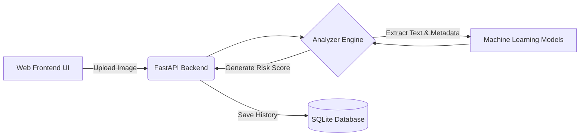

<div align="center">
  
  
  <h1>🛡️ Trust OS 🛡️</h1>
  <h3><em>Next-Generation AI Truth & Cyber Threat Detector</em></h3>

  <p>
    <b>Empowering digital safety by detecting deepfakes, phishing attempts, and manipulated content with state-of-the-art AI.</b>
  </p>

  <p>
    <a href="https://github.com/prajwal-2201/trustos-ai-detector/issues">
      
    </a>
    <a href="https://github.com/prajwal-2201/trustos-ai-detector/stargazers">
      
    </a>
    
    
  </p>
</div>

---

## 🌟 About The Project

In an era of digital deception, **Trust OS** acts as your personal forensic analyst. Whether you're verifying a suspicious UPI payment screenshot, checking a WhatsApp message for phishing links, or determining if a face is AI-generated, Trust OS provides a unified, instant scanning interface. 

> *"Trust, but verify. With Trust OS, verification is instant."*

### 🔮 Core Capabilities

| Feature | Description |
| :--- | :--- |
| 🤖 **Deepfake & AI Detection** | Spots GAN artifacts and unnatural pixel patterns in generated imagery. |
| 💸 **Financial Fraud Scanner** | Analyzes payment proofs for manipulation, incorrect fonts, and forged timestamps. |
| 🎣 **Phishing Protection** | Extracts and evaluates URLs and QR codes against known threat databases. |
| 📊 **Intelligent Risk Scoring** | Every scan returns a calculated confidence percentage and actionable risk score. |

---

## 🏗️ Architecture



---

## 🚀 Getting Started

### 1️⃣ Prerequisites
- **Python 3.8+** installed on your machine.

### 2️⃣ Installation
Clone the repository and install the backend requirements:

```bash
git clone https://github.com/prajwal-2201/trustos-ai-detector.git
cd trustos-ai-detector/backend
pip install -r requirements.txt
```

### 3️⃣ Launch the Application
Run the FastAPI application. This single command boots up both the backend API and serves the sleek web frontend:

```bash
uvicorn main:app --host 0.0.0.0 --port 8000 --reload
```

✨ **You're all set!** Open your browser and navigate to `http://localhost:8000` to start scanning.

---

## 📡 API Reference

Integrate Trust OS into your own workflows using our clean REST API:

- `POST /upload` - Upload a file for deep threat analysis.
- `GET /demo?type={scenario}` - Run simulated scans (e.g., *Payment Screenshot*, *AI Face*).
- `GET /history` - Retrieve your past scan logs.
- `DELETE /history/{item_id}` - Clear a specific scan from the local database.

---

## 🤝 Contributing

We welcome contributions from the community! If you have ideas for new detection models or UI enhancements, please open an issue or submit a Pull Request.

1. Fork the Project
2. Create your Feature Branch (`git checkout -b feature/AmazingFeature`)
3. Commit your Changes (`git commit -m 'Add some AmazingFeature'`)
4. Push to the Branch (`git push origin feature/AmazingFeature`)
5. Open a Pull Request

---

<div align="center">
  <p>Made with ❤️ for a safer internet.</p>
</div>
